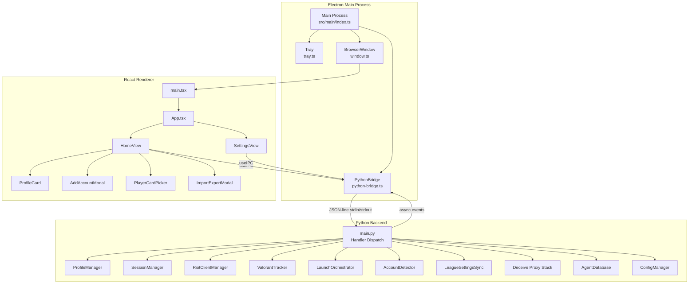
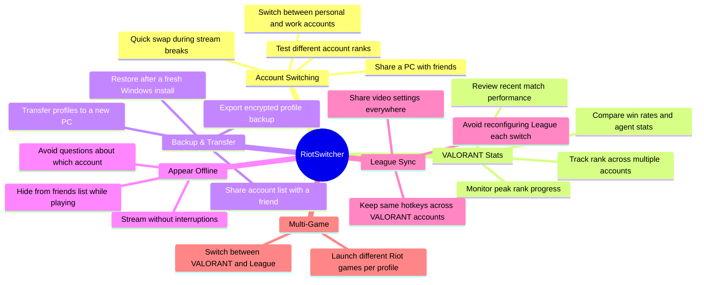
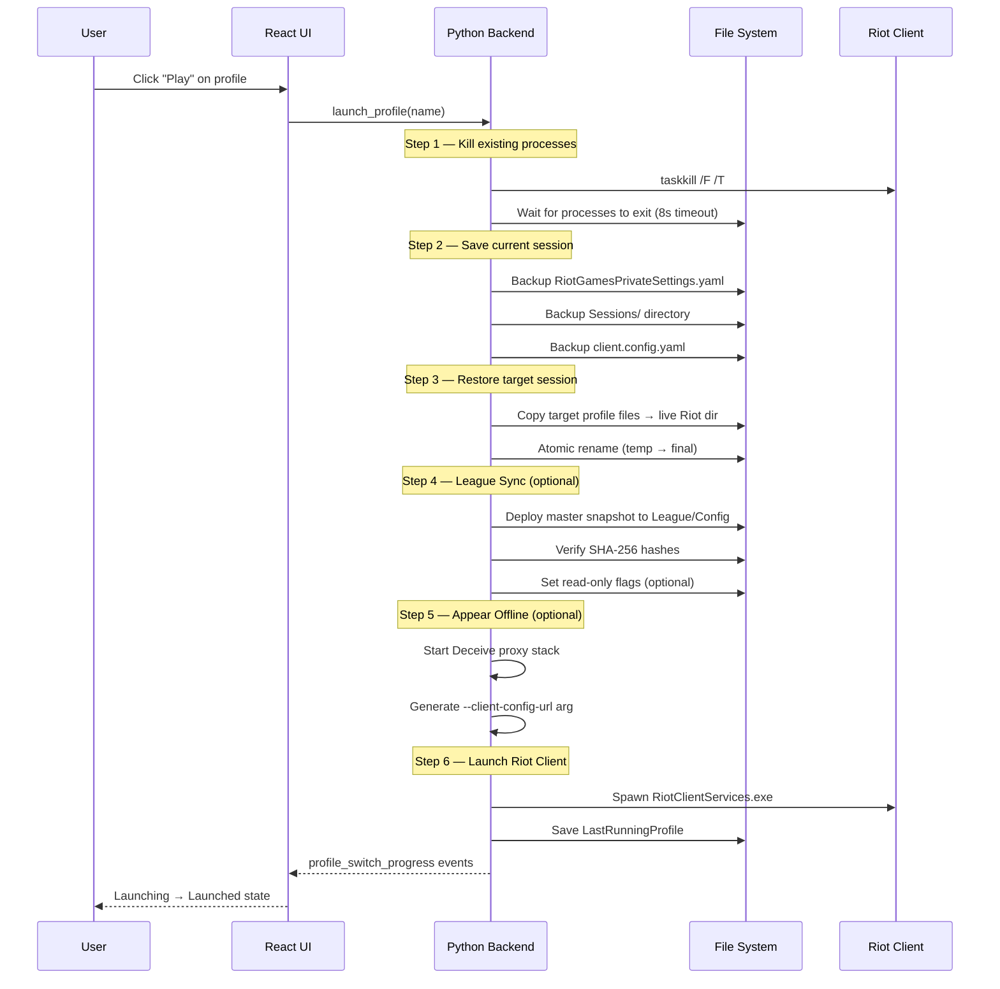
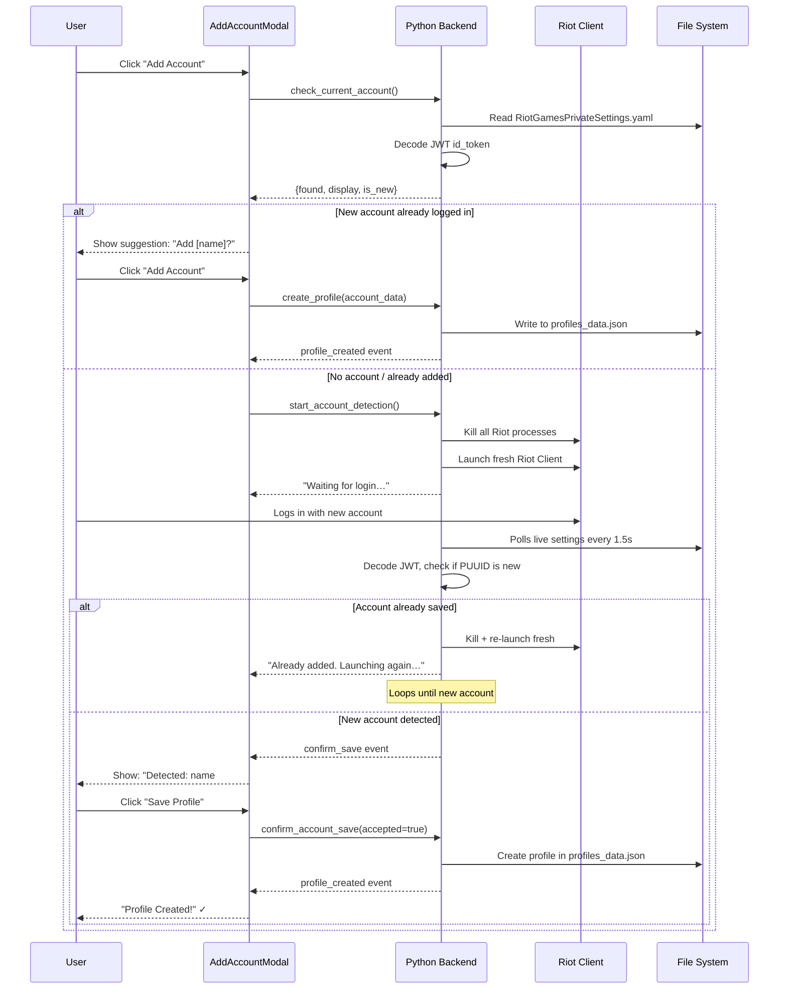
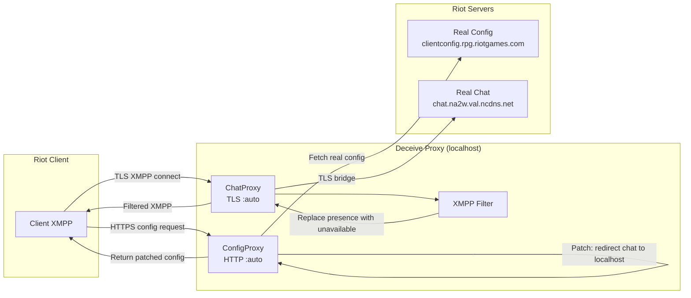
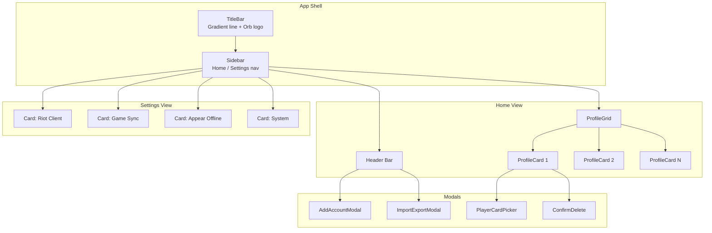
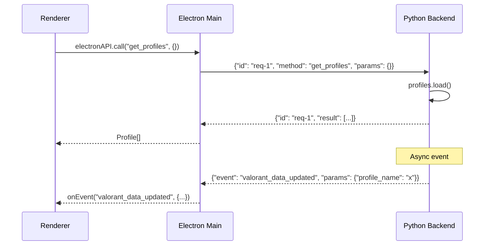
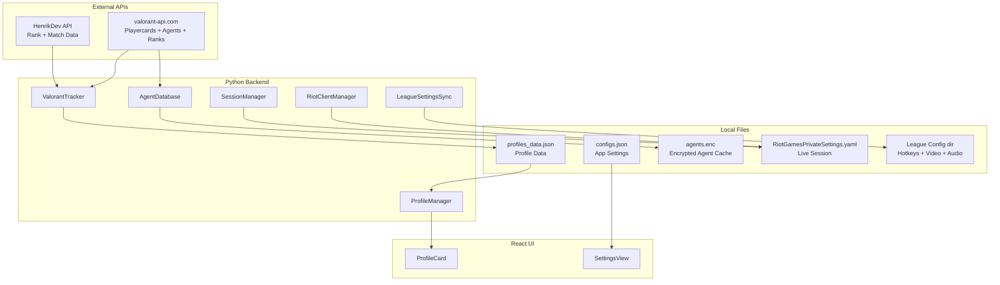
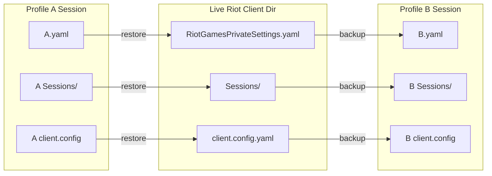

# RiotSwitcher v2.0

> Instantly switch between multiple Riot Games accounts — VALORANT, League of Legends, and more.

RiotSwitcher is a desktop application that lets you manage and switch between multiple Riot Games accounts with zero hassle. It swaps session files on disk so you never have to log out and log back in manually.

---

## Tech Stack

| Layer | Technology |
|-------|-----------|
| Desktop Shell | Electron 35 (Chromium) |
| Frontend | React 19, TypeScript, Tailwind CSS |
| Backend | Python 3.9+ |
| IPC | JSON-line over stdin/stdout |
| Encryption | PBKDF2-HMAC-SHA256 + Fernet (480k iterations) |
| VALORANT API | HenrikDev API v3, valorant-api.com |
| Presence Proxy | Custom MITM (ported from Deceive) |

---

## Architecture

RiotSwitcher runs as **three cooperating processes**:



---

## Features

### Account Management
- **Instant account switching** — swap Riot Client session files without re-login (auto-kills running processes)
- **Auto-detect new accounts** — detects when a new Riot account logs in and offers to save it
- **Profile cards** — Valorant lobby-style cards with full playercard art, rank icon, agent icon, RR, wins/losses
- **Drag-and-drop reorder** — arrange profiles however you like
- **Playercard picker** — choose from 3000+ VALORANT playercards or let the system auto-detect your equipped card

### VALORANT Integration
- **Live rank tracking** — fetches MMR, RR, peak rank, win rate from HenrikDev API
- **Agent stats** — top agent icon, ACS, per-agent performance breakdown
- **Recent match history** — last 30 competitive games with detailed stats
- **Agent visuals** — agent display icons, portraits, backgrounds, and role-colored accents

### Cross-Platform Features
- **League of Legends settings sync** — share hotkeys, video, audio, and interface settings across profiles
- **Appear Offline** — MITM proxy (ported from Deceive) that makes you invisible to friends
- **Import/Export** — encrypted backup of all profiles, transferable across PCs with a passkey

### System
- **Auto-kill on launch** — kills VALORANT + Riot Client automatically when switching profiles
- **Close/Minimize to tray** — keep RiotSwitcher running in the background
- **Auto-detect Riot Client** — finds install directory from registry, JSON, and metadata

---

## Use Cases



---

## Key Flows

### Profile Switch Sequence



### Add Account Flow



### Import/Export Flow

```mermaid
sequenceDiagram
    participant U as User
    participant UI as ImportExportModal
    participant BE as Python Backend
    participant FS as File System

    rect rgb(30, 40, 60)
    Note over U,FS: Export Flow
    U->>UI: Enter passkey + click Export
    UI->>BE: export_profiles(passkey)
    BE->>FS: Load profiles_data.json
    BE->>BE: JSON serialize profiles
    BE->>BE: PBKDF2 derive key (480k iterations)
    BE->>BE: Fernet encrypt with derived key
    BE-->>UI: Encrypted bytes
    UI->>UI: Download as .rsprofile file
    UI-->>U: "Exported!" ✓
    end

    rect rgb(30, 40, 60)
    Note over U,FS: Import Flow
    U->>UI: Select .rsprofile file + enter passkey
    UI->>BE: import_profiles(passkey, data, merge=true)
    BE->>BE: PBKDF2 derive key (480k iterations)
    BE->>BE: Fernet decrypt with derived key
    BE->>BE: JSON parse profiles
    BE->>FS: Load existing profiles
    BE->>BE: Deduplicate by PUUID + name
    BE->>FS: Write merged profiles
    BE-->>UI: {imported, skipped, total}
    UI-->>U: "Imported X of Y profiles" ✓
    end
```



### Appear Offline Proxy Stack



---

## Component Architecture



---

## IPC Protocol

Communication between the Electron main process and Python backend uses a **JSON-line protocol** over stdin/stdout:



### All IPC Handlers

| # | Handler | Description |
|---|---------|-------------|
| 1 | `ping` | Health check |
| 2 | `get_profiles` | List all profiles |
| 3 | `create_profile` | Create a new profile |
| 4 | `delete_profile` | Delete a profile |
| 5 | `update_profile` | Update profile data |
| 6 | `rename_profile` | Rename a profile |
| 7 | `reorder_profiles` | Reorder profile list |
| 8 | `get_valorant` | Get VALORANT stats for a profile |
| 9 | `refresh_valorant` | Trigger rank/stat refresh |
| 10 | `refresh_valorant_all` | Refresh all profiles |
| 11 | `has_api_key` | Check if HenrikDev API key exists |
| 12 | `get_config` | Get all config values |
| 13 | `set_config` | Set a config value |
| 14 | `set_config_many` | Set multiple config values |
| 15 | `set_riot_client_location` | Set Riot Client install path |
| 16 | `detect_riot_client_location` | Auto-detect Riot Client path |
| 17 | `get_riot_client_status` | Get Riot Client status |
| 18 | `kill_riot_processes` | Kill all Riot processes |
| 19 | `stop_riot_client` | Kill and wait for Riot Client |
| 20 | `launch_riot_client` | Spawn Riot Client |
| 21 | `launch_profile` | Full profile switch sequence |
| 22 | `stop_profile` | Stop profile switch |
| 23 | `read_live_account` | Read current logged-in account |
| 24 | `check_current_account` | Check if current account is new |
| 25 | `detect_live_account_new` | Check if account is new vs saved |
| 26 | `start_account_detection` | Start background account detection |
| 27 | `stop_account_detection` | Stop account detection |
| 28 | `account_detection_state` | Check if detection is running |
| 29 | `confirm_account_save` | Accept/decline saving detected account |
| 30 | `save_session` | Backup session files for a profile |
| 31 | `restore_session` | Restore session files from backup |
| 32 | `has_session` | Check if profile has saved session |
| 33 | `league_find_dir` | Detect League install directory |
| 34 | `league_capture` | Capture League settings snapshot |
| 35 | `league_apply` | Deploy settings to League Config |
| 36 | `league_refresh` | Validate master snapshot |
| 37 | `league_dir_differs` | Compare live vs master settings |
| 38 | `league_cleanup_readonly` | Remove read-only flags |
| 39 | `league_resolve_source` | Get source profile info |
| 40 | `league_get_metadata` | Get snapshot metadata |
| 41 | `presence_start` | Start Appear Offline proxy |
| 42 | `presence_stop` | Stop Appear Offline proxy |
| 43 | `presence_state` | Get proxy state |
| 44 | `presence_get_ports` | Get proxy port info |
| 45 | `presence_get_launch_args` | Get Riot launch args with proxy |
| 46 | `export_profiles` | Encrypt and export profiles |
| 47 | `import_profiles` | Decrypt and import profiles |
| 48 | `get_playercards` | Fetch all playercards |
| 49 | `set_playercard` | Set profile playercard |

---

## Data Flow



---

## Configuration

| Config Key | Default | Description |
|-----------|---------|-------------|
| `RiotClientLocation` | `""` | Riot Client install directory |
| `LaunchProduct` | `"valorant"` | `"valorant"` or `"riot"` |
| `SyncGameSettings` | `false` | Enable League settings sync |
| `SharedSettingsSourceProfile` | `""` | Which profile's League settings are master |
| `AppearOffline` | `false` | Enable Deceive presence proxy |
| `EnforceReadOnlySettings` | `true` | Set read-only on deployed League files |
| `CloseToTray` | `true` | Hide to tray on window close |
| `MinimizeToTray` | `false` | Hide to tray on minimize |
| `Language` | `"en"` | UI language |

---

## Setup

### Development

```bash
# Install dependencies
npm install

# Run in dev mode (Electron + React hot reload + Python backend)
npm run dev
```

### Build

```bash
npm run build
```

### API Key

Create a `.env` file in the project root:

```
HENRIKDEV_API_KEY=your_key_here
```

Get a free key at [https://henrikdev.xyz](https://henrikdev.xyz).

---

## How Session Swapping Works

RiotSwitcher doesn't use any Riot APIs or inject code into the game. It swaps **session files** on disk:



When you click **Play**, RiotSwitcher:
1. Auto-kills any running Riot Client / VALORANT processes
2. Backs up the current live session files into the current profile's directory
3. Copies the target profile's saved session files over the live files
4. Relaunches the Riot Client — it starts with the target account already logged in

All file operations are **atomic** (write to temp file, then rename) to prevent corruption.

---

## License

MIT
